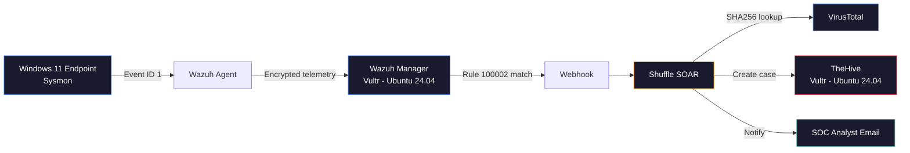
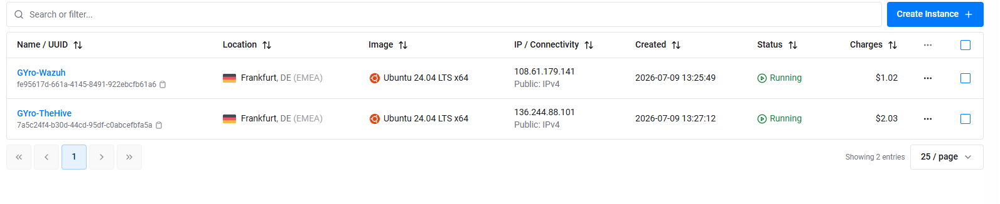
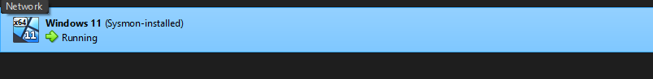
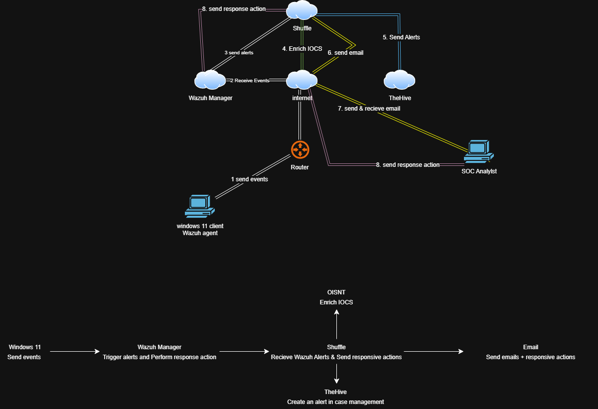
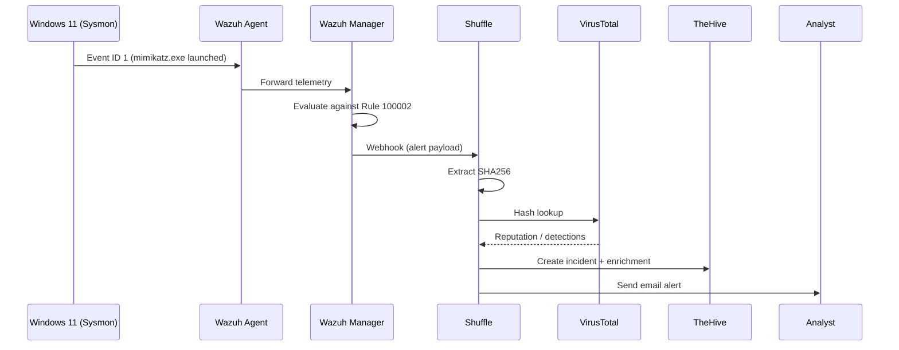
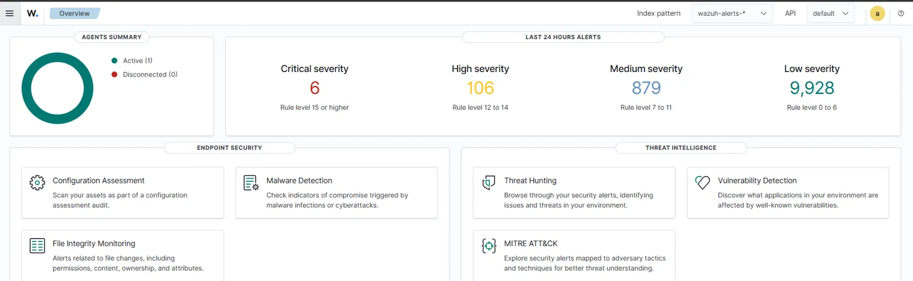
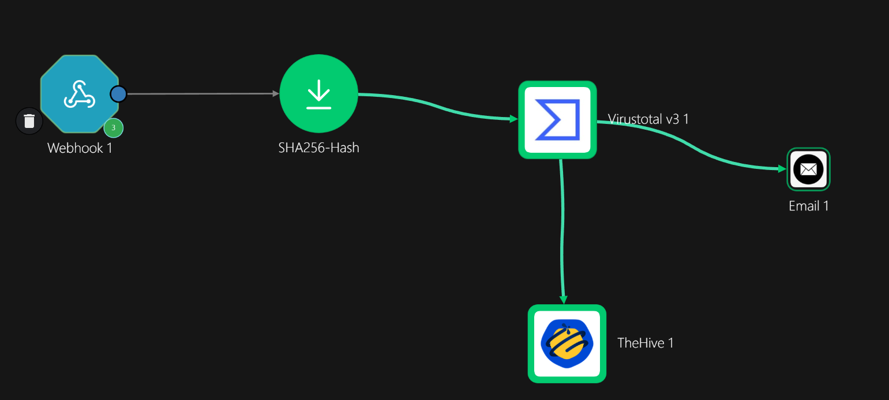
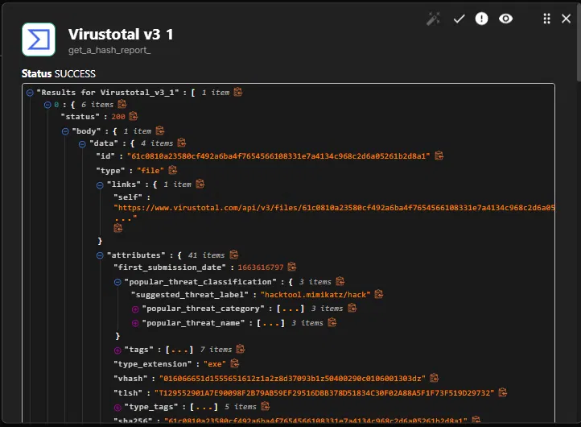
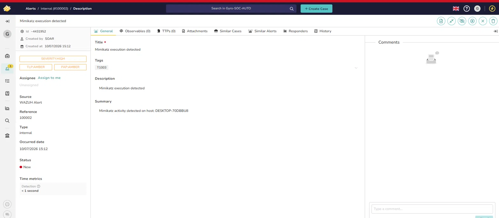
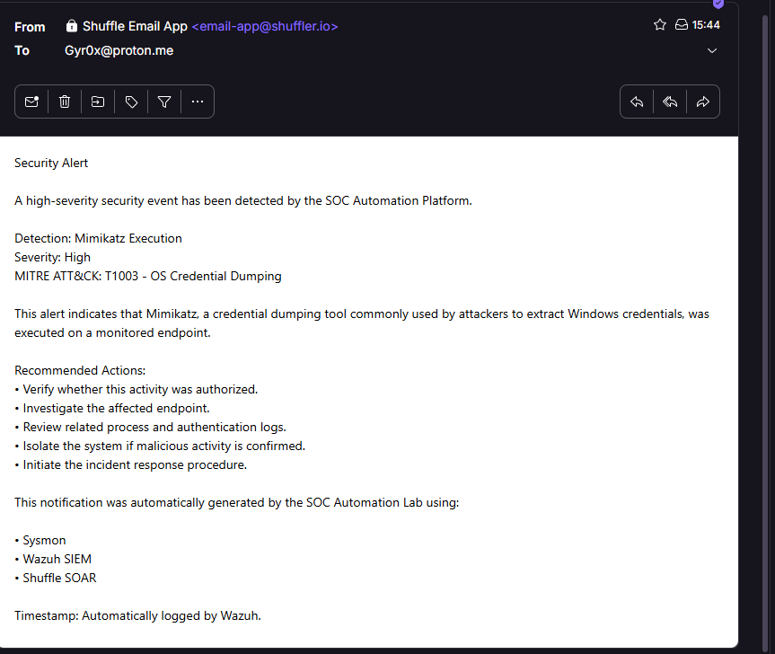

<div align="center">

# SOC Automation Lab

**End-to-end detection & response pipeline built on Wazuh, Sysmon, Shuffle SOAR, TheHive and VirusTotal**

[](https://wazuh.com/)
[](https://shuffler.io/)
[](https://thehive-project.org/)
[](https://www.virustotal.com/)
[](https://attack.mitre.org/techniques/T1003/)
[](#)

</div>

---

## Table of Contents

- [Overview](#overview)
- [Project Objectives](#project-objectives)
- [Features](#features)
- [Lab Architecture](#lab-architecture)
- [Infrastructure](#infrastructure)
- [Technology Stack](#technology-stack)
- [Detection Workflow](#detection-workflow)
- [Detection Rule](#detection-rule)
- [Workflow Demonstration](#workflow-demonstration)
- [Screenshots](#screenshots)
- [MITRE ATT&CK Mapping](#mitre-attck-mapping)
- [Repository Structure](#repository-structure)
- [Skills Demonstrated](#skills-demonstrated)
- [Challenges & Lessons Learned](#challenges--lessons-learned)
- [Future Improvements](#future-improvements)

---

## Overview

This lab simulates a small but functional SOC pipeline, from endpoint telemetry to analyst notification, using entirely open-source tooling.

A Windows 11 endpoint runs Sysmon for process-level visibility. Telemetry is shipped through a Wazuh Agent to a Wazuh Manager, where a custom detection rule fires on Mimikatz execution. That alert triggers a webhook into Shuffle, which handles enrichment (VirusTotal), case creation (TheHive), and analyst notification (email) — no manual triage required to get an actionable case on an analyst's desk.

The point of the project isn't the malware sample. It's the plumbing: getting a real SIEM to talk to a real SOAR platform, to a real case management tool, reliably, with a rule that actually maps to an ATT&CK technique instead of a toy signature.

---

## Project Objectives

- Build an end-to-end SOC detection pipeline from raw telemetry to analyst notification
- Develop a custom Wazuh detection rule mapped to a real MITRE ATT&CK technique
- Automate indicator enrichment using the VirusTotal API
- Automatically create and populate incidents in TheHive on alert
- Demonstrate a realistic SOC analyst triage workflow, end to end, without manual steps

---

## Features

| Capability | Description |
|---|---|
| Endpoint monitoring | Sysmon deployed on a Windows 11 VM, tuned for process creation (Event ID 1) |
| Log forwarding | Wazuh Agent ships Sysmon telemetry to a remote Wazuh Manager over TLS |
| Custom detection | Hand-written Wazuh rule (ID `100002`) fires on `mimikatz.exe` execution |
| SOAR automation | Shuffle workflow triggered via webhook on alert |
| Threat intel enrichment | SHA256 of the offending binary checked against VirusTotal |
| Case management | Incident auto-created in TheHive with enrichment data attached |
| Analyst notification | Email alert sent the moment a case is opened |
| ATT&CK mapping | Detection tied to T1003 (OS Credential Dumping) |

---

## Lab Architecture



<details>
<summary><b>Network / host layout</b></summary>

| Host | Role | OS | Provider | Region |
|---|---|---|---|---|
| GYro-Wazuh | Wazuh Manager | Ubuntu 24.04 LTS x64 | Vultr | Frankfurt, DE (EMEA) |
| GYro-TheHive | TheHive | Ubuntu 24.04 LTS x64 | Vultr | Frankfurt, DE (EMEA) |
| GYro-Windows | Monitored Windows agent | Windows 11 | VirtualBox (local) | — |

</details>

---

## Infrastructure

Both backend services run on separate Vultr instances (Ubuntu 24.04 LTS, Frankfurt) to keep the SIEM and case management layers isolated, which also mirrors how these are usually segmented in production.

The monitored endpoint is a Windows 11 VM running under VirtualBox, kept isolated on a host-only network segment so the Mimikatz sample never has a path to anything but the lab.




---

## Technology Stack



<table>
<tr><td width="50%" valign="top">

**Detection & Monitoring**
- Wazuh (SIEM)
- Sysmon
- Custom Wazuh detection rules
- MITRE ATT&CK mapping

**Response & Automation**
- Shuffle (SOAR)
- TheHive (Case Management)
- VirusTotal (Threat Intel)

</td><td width="50%" valign="top">

**Infrastructure**
- Vultr (Cloud hosting)
- Ubuntu 24.04 LTS
- VirtualBox
- Windows 11

**Delivery**
- Email notifications
- Webhook-driven automation

</td></tr>
</table>

---

## Detection Workflow



Full workflow export, importable directly into Shuffle: [`workflow/Gyro-SOC-Auto-Project-Update.json`](workflow/Gyro-SOC-Auto-Project-Update.json)

---

## Detection Rule

Custom Wazuh rule targeting Mimikatz execution via Sysmon Event ID 1.

```xml
<rule id="100002" level="15">
  <if_sid>61603</if_sid>
  <field name="win.eventdata.originalFileName" type="pcre2">(?i)mimikatz\.exe</field>
  <description>Mimikatz execution detected via Sysmon (Credential Dumping)</description>
  <mitre>
    <id>T1003</id>
  </mitre>
</rule>
```

| Field | Value |
|---|---|
| Rule ID | `100002` |
| Trigger | Sysmon Event ID 1 — process creation |
| Match logic | Original file name matches `mimikatz.exe` |
| Severity | 15 (high) |
| ATT&CK Technique | [T1003 – OS Credential Dumping](https://attack.mitre.org/techniques/T1003/) |

Full rule definition: [`rules/local_rules.xml`](rules/local_rules.xml)

---

## Workflow Demonstration

<details>
<summary><b>1. Alert fires in Wazuh</b></summary>

Wazuh evaluates the incoming Sysmon telemetry against Rule `100002` and generates a high-severity alert the moment `mimikatz.exe` is observed.



</details>

<details>
<summary><b>2. Shuffle picks up the webhook</b></summary>

The alert is forwarded to a Shuffle workflow, which parses the payload, pulls the SHA256, and kicks off enrichment.



</details>

<details>
<summary><b>3. VirusTotal enrichment</b></summary>

The extracted hash is queried against VirusTotal and the detection ratio / vendor verdicts are attached to the case.



</details>

<details>
<summary><b>4. Case opens in TheHive</b></summary>

Shuffle creates a fully populated incident in TheHive, including the raw alert, host details, and VirusTotal results.



</details>

<details>
<summary><b>5. Analyst is notified</b></summary>

An email lands in the analyst's inbox with a summary and a direct link to the TheHive case.



</details>

---

## Screenshots

| | |
|---|---|
|  |  |
|  |  |

---

## MITRE ATT&CK Mapping

| Tactic | Technique | ID | Coverage |
|---|---|---|---|
| Credential Access | OS Credential Dumping | [T1003](https://attack.mitre.org/techniques/T1003/) | Wazuh custom rule via Sysmon Event ID 1 |

---

## Repository Structure

```
SOC-Automation-Lab/
├── README.md
├── assets/                              # Screenshots referenced throughout this README
├── rules/
│   └── local_rules.xml                  # Custom Wazuh detection rule (ID 100002)
└── workflow/
    └── Gyro-SOC-Auto-Project-Update.json  # Shuffle workflow export — import directly into Shuffle
```

---

## Skills Demonstrated

`Detection Engineering` · `Threat Detection` · `Threat Hunting` · `SIEM Administration` · `SOAR Automation` · `Windows Event Monitoring` · `Linux Administration` · `Threat Intelligence` · `Incident Response` · `Cloud Infrastructure` · `Detection Rule Development`

---

## Challenges & Lessons Learned

<details>
<summary><b>Challenges</b></summary>

- Configuring TLS between the Wazuh Agent and Manager
- Debugging webhook payload formatting between Wazuh and Shuffle
- Troubleshooting Elasticsearch authentication for TheHive's backend
- Configuring TheHive API authentication for case creation
- Handling VirusTotal API rate limits during testing

</details>

<details>
<summary><b>Lessons Learned</b></summary>

- Writing custom Wazuh detection rules from raw Sysmon fields rather than relying on defaults
- Working with REST APIs across three different platforms with different auth models
- Parsing and filtering Sysmon telemetry to isolate the fields that actually matter for detection
- Building an automated incident response workflow end to end, not just a single integration

</details>

---

## Future Improvements

- [ ] Port detection logic to Sigma for cross-SIEM portability
- [ ] Add Slack notification branch alongside email
- [ ] Add Microsoft Teams integration
- [ ] Expand coverage to PowerShell-based credential dumping (Invoke-Mimikatz)
- [ ] Integrate YARA rules for file-based detection
- [ ] Extend monitoring to a full Active Directory environment
- [ ] Add ransomware behavior detection rules
- [ ] Automate endpoint isolation as a response action
- [ ] Enrich IOCs against additional threat intel feeds beyond VirusTotal

---

<div align="center">

<sub>Built as part of ongoing SOC / detection engineering practice.</sub>

</div>
